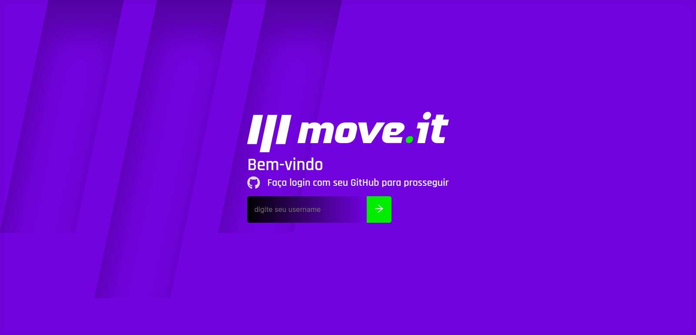
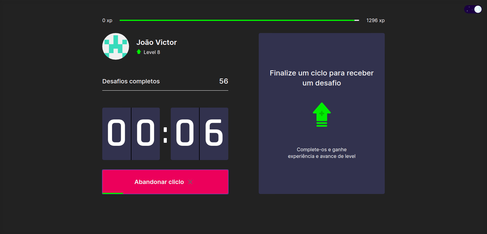

# Move It

O Move It foi criado e implementado num evento chamado Next Level Week, da RocketSeat, na sua 4ª edição. Esta semana trouxe uma aplicação cuja finalidade é ajudar devs que passam muito tempo na frente de computadores a fazerem exercícios.

## 🚀 Tecnologias utilizadas

- [TypeScript](https://www.typescriptlang.org/)
- [NextJS](https://nextjs.org/)
- [ReactJS](https://reactjs.org/)
- [HTML](https://developer.mozilla.org/pt-BR/docs/Web/HTML)
- [CSS](https://developer.mozilla.org/pt-BR/docs/Web/CSS)
- [Yarn](https://yarnpkg.com/)

### 🔨 Como rodar
- Clone este repositorio && cd;
- `yarn` para instalar dependências
- `yarn dev` para rodar em ambiente de desenvolvimento.

- Subindo de nivel

### 📈 Como contribuir?
- Fork este repositório;
- Crie uma branch com sua feature: `git checkout -b my-feature`
- Commit as mudanças: `git commit -m 'feat: My new feature'`
- Push branch: `git push origin my-feature`
